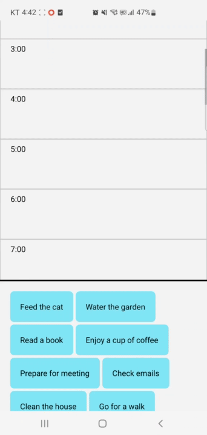

# GestureTest

A React Native toy project demonstrating seamless drag-and-drop functionality between different scrollable containers using gestures and animations.

## Project Overview

This project showcases how to implement independent drag-and-drop operations between two separate scroll views without interfering with the native scrolling behavior. It allows users to freely move items between containers while maintaining each view's original functionality.

## Demo

<p align="center">
  
</p>

## Key Features

- **Independent Scroll Views**: Drag operations don't interfere with scrolling behavior
- **Cross-Container Drag & Drop**: Move items freely between different scrollable containers
- **Realistic Drag Animation**: Items follow finger movement with spring animations
- **Visual Feedback**: Container highlighting when items are dragged over them
- **Event-Based Architecture**: Custom event bus for decoupled component communication

## Implementation Details

### Components

- **HourBox**: Example container that can receive and display items
- **TodoList**: Another container displaying items that can be dragged
- **TodoBox**: Individual draggable item
- **MoveableTodoBox**: Animated representation of an item being dragged

### Technical Highlights

- Uses **React Native Gesture Handler** for advanced gesture recognition
- Implements **Reanimated** for smooth animations
- Custom **event bus system** for cross-component communication without prop drilling
- **Zustand** for lightweight state management
- Precise coordinate tracking for accurate drop zone detection
- Separation of concerns between scrolling and dragging gestures

## How It Works

1. Long-press an item to start dragging
2. The original item is hidden while a moveable clone follows your finger
3. Scroll views maintain their normal behavior during drag operations
4. When dragging over a different container, it highlights to indicate a valid drop zone
5. Release to drop the item in the new container
6. The source container removes the item while the target container adds it

## Getting Started

This is a React Native project bootstrapped with `@react-native-community/cli`.

```bash
# Install dependencies
yarn install

# For iOS
yarn run ios

# For Android
yarn run android
```

## Learning Points

This project demonstrates several advanced React Native concepts:

- Simultaneous gesture handling without conflicts
- Independent component interactions via events
- Animation techniques for realistic drag feedback
- Coordinate system manipulation across different views
- State management with Zustand
